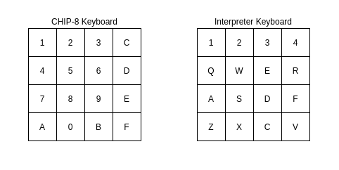
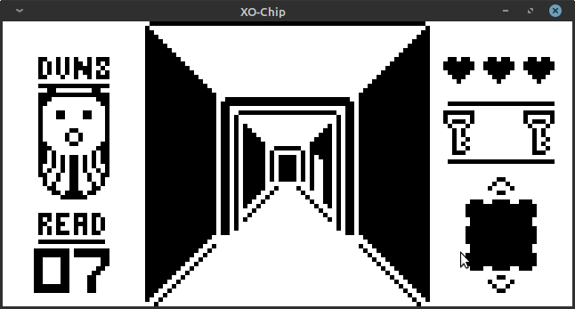
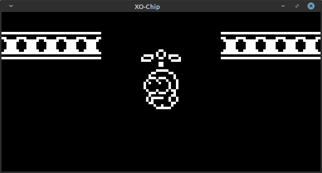

# XO-Chip

**Description**
  - A XO-Chip (SuperChip + Octo Extensions) emulator/interpreter written in c using the CSFML library for IO.
  - CHIP-8 is an interpreted programming language, developed by Joseph Weisbecker. It was initially used on the COSMAC VIP and Telmac 1800 8-bit microcomputers in the mid-1970s. CHIP-8 programs are run on a CHIP-8 virtual machine. It was made to allow video games to be more easily programmed for these computers. (Source: https://en.wikipedia.org/wiki/CHIP-8)

**References**
  - [Chip8 technical reference](http://devernay.free.fr/hacks/chip8/C8TECH10.HTM)
  - [Super Chip](https://github.com/JohnEarnest/Octo/blob/gh-pages/docs/SuperChip.md)
  - [Octo Extensions](http://johnearnest.github.io/Octo/docs/XO-ChipSpecification.html)

**Requirments**
  - Unix based OS.
  - gcc compiler.
  - [CSFML library](https://www.sfml-dev.org/download/csfml/).

**Controls**
  

**Games**
  - Some games are available inside the /roms folder.
  - [More Chip8, SuperChip and XO-Chip games](https://johnearnest.github.io/chip8Archive/?sort=platform)

**Images**
- Tetris   

- Sweetcopter   